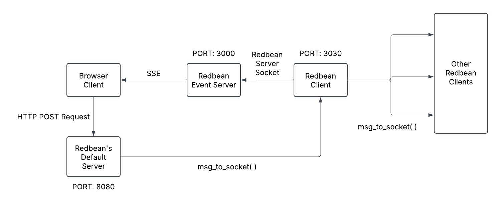
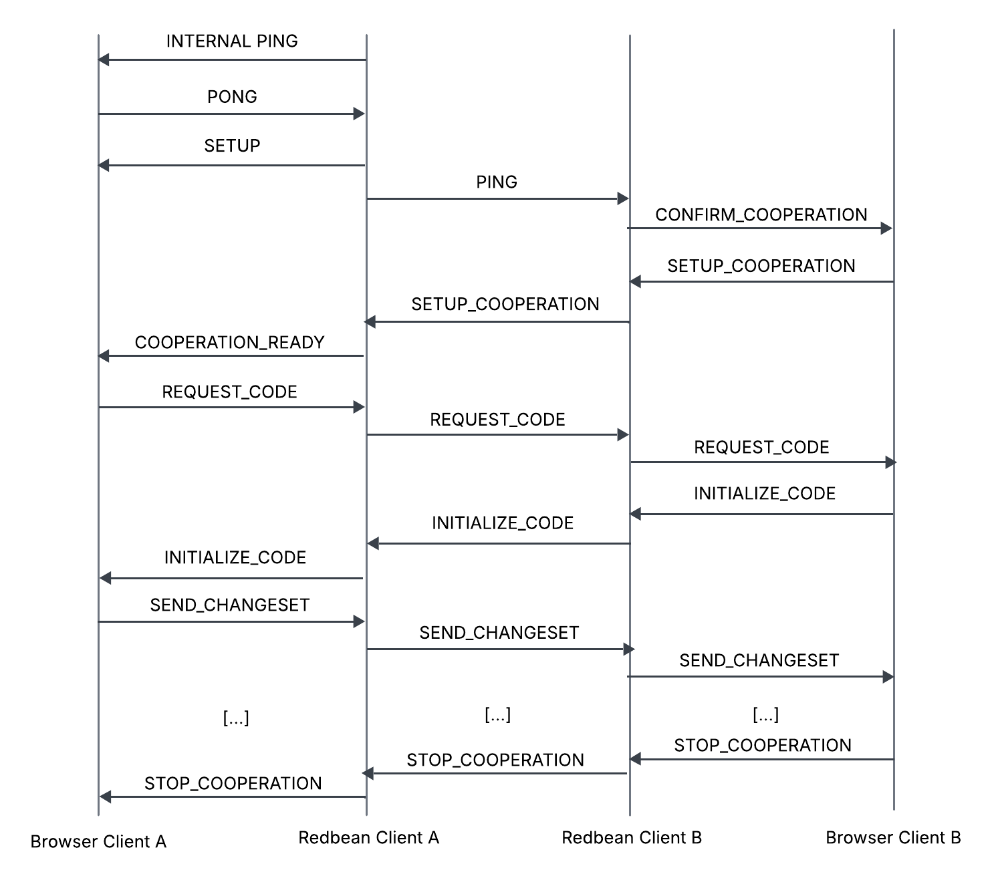

# Cosmopolitan's redbean - ICP patch

A patched version of [redbean 3.0.0](https://redbean.dev/) for use with [icp-p2p](https://github.com/Iron16Bit/icp-p2p).

## Internal Architecture

A redbean is a Cosmopolitan-based, platform-independant, zip file that also works as an executable file which is able to locally host its content.
The scope of this project is to implement a P2P connection between the two browsers (on 2 different machines) that are showing the content hosted by the redbean.

The difficulty of this operation comes from the fact that a redbean is platform-independant, for this reason:
- It is only possible to use [functions that have been implemented in Cosmopolitan](https://justine.lol/cosmopolitan/functions.html)
- It is only possible to use Browser Javascript and no Node.js, as bundling a Javascript file with Node.js into a plug and play executable results in a **platform-dependant** executable

These constraints made Browser Javascript's websockets not usable, as they need to connect to a websocket server, but the C websocket library is not supported by Cosmopolitan. To solve the issue, the following architecture was developed:

The redbean creates an HTTP server by default on port 8080. This server does not handle HTTP POST Requests, which are discarded. I took advantage of this by using them myself, making this way possible the communication *browser -> redbean*.
A second HTTP server is created on port 3000. The browser connects to this port and lisents for events. When the redbean wants to communicate with the browser, it just needs to send an event. As such, we have the *redbean -> browser* communication.

Finally, to separate internal and external communication, a socket server is created on port 3030. It is used to send MSGs to other redbean's sockets and receive those MSGs. Thus, we have the *redbean -> redbean* communication.

## MSG Exchange

### STEP 1: Initialization

When the redbean local HTTP server is ready and the browser accesses the hosted content, the redbean sends an **INTERNAL PING** MSG. This is simply used to check whether the Browser Client can listen to the redbean.

When the Browser Client receives the **INTERNAL PING**, it simply answers with a **PONG**.

Once the redbean is sure the redbean can listen to it, it sends a **SETUP** MSG containing as data the user's local IP address.

### STEP 2: Connection

On the browser client, the user (*Peer A*) is able to see his local IP and can enter the IP the user he wants to connect to (*Peer B*). When he does so, a **PING** MSG is sent to the other user's redbean.

When the *redbean B* receives a **PING**, it forwards a **CONFIRM_COOPERATION** MSG to *browser_client B* to ask for the user's consent to connect to *Peer A*.

If the user confirms, a **SETUP_COOPERATION** MSG is forwarded to *redbean A*.

*Redbean A* then sends a **COOPERATION_READY** MSG to *Browser Client A*. The connection has now been established.

### STEP 3: Collaboration

Since *Peer A* connected to *Peer B*, *Peer B* is considered the host. For this reason a **REQUEST_CODE** MSG is forwarded to *Browser Client A* to get the code in its ICPs slides editor.

The code is sent back as data in an **INITIALIZE_CODE** MSG.

Now that the editors are the same, when one of the users modify something, a **SEND_CHANGESET** MSG is sent from the user that has modified to the peer. This messages contains the changes as data, which are applied to the peer's editor.

### STEP 4: Disconnection

When one of the peers interrupts the collaborative session, a **STOP_COLLABORATION** MSG is sent to the other peer.

### Other

The only MSG that isn't shown in the image is the **REFRESH** MSG. It is sent from *Browser Client A* to *redbean A* when the page is refreshed, is order to receive back again a **SETUP** MSG, otherwise its data is lost.